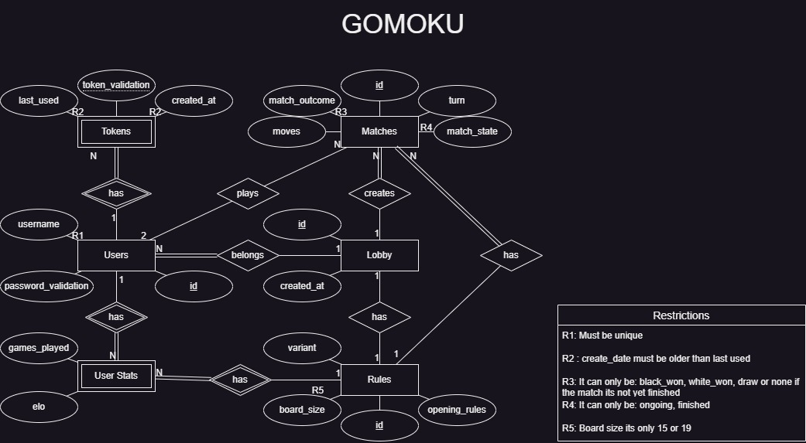
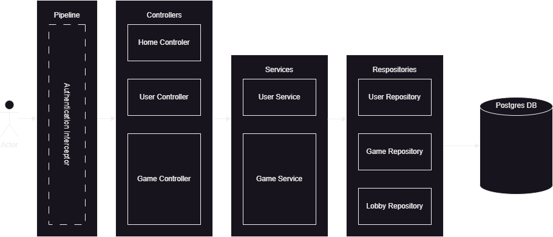

# Gomoku API Documentation

## Table of Contents

* [Introduction](#introduction)
* [Modeling the Database](#modeling-the-database)
    * [Conceptual Model](#conceptual-model)
    * [Physical Model](#physical-model)
* [Application Architecture](#application-architecture)
    * [Controller Layer](#controller-layer)
    * [Services Layer](#services-layer)
    * [Repository Layer](#repository-layer)
    * [Data Representation](#data-representation)
    * [Authentication](#authentication)
    * [Error Handling](#error-handling)
    * [Problem Handling](#problem-handling)
    * [Running the Application](#running-the-application)
* [Conclusions - Critical Evaluation](#conclusions---critical-evaluation)

## Introduction

The backend server is an API that provides the functionality for the Gomoku game.
It is written in Kotlin in a JVM gradle project.

The JVM application is a simple Spring Boot application, built with Spring Initializr.
Some used dependencies are:

* **Spring Web** - for the REST API

To read more about the JVM application structure, see the [Application Architecture](#application-architecture)
section.

## Modeling the Database

### Conceptual Model

The following diagram holds the Entity-Relationship model for the information managed by the system.



### Physical Model

The physical model of the database is available in [create-tables.sql](../code/jvm/src/sql/create-tables.sql).

To implement and manage the database PostgreSQL was used.

The [`code/sql`](../code/jvm/src/sql) folder contains all SQL scripts developed:

[create-tables.sql](../code/jvm/src/sql/create-tables.sql) - creates the database schema;
[insert-test-data.sql](../code/jvm/src/sql/insert-test-data.sql) - erases the previous data and inserts a dummy dataset;
We highlight the following aspects of this model:

All primary keys are represented by the id attribute and are Generated Values;
Other attributes that are not primary keys, but also identify the entity are UNIQUE;
All the restrictions described in the Conceptual Model chapter are reflected in the physical model, using check constraints.


## Application Architecture



The application is structured as follows:

- [/domain](../code/jvm/src/main/kotlin/gomoku/server/domain) - contains the domain classes;
- [/http](../code/jvm/src/main/kotlin/gomoku/server/http) - contains the controller layer of the application using Spring Web MVC ;
- [/repository](../code/jvm/src/main/kotlin/gomoku/server/repository) - contains the data access layer of the application using JDBI;
- [/services](../code/jvm/src/main/kotlin/gomoku/server/services) - contains the services layer of the application;
- [/validation](../code/jvm/src/main/kotlin/gomoku/server/validation) - contains class for the password validation;
- [/utils](../code/jvm/src/main/kotlin/gomoku/utils) - contains utility classes;

### [Controller Layer](../code/jvm/src/main/kotlin/gomoku/server/http)

The controller layer is responsible for handling the HTTP requests, processing them and give a response back, which are 
annotated with `@RestController` and `@RequestMapping`, and the methods are annotated with `@GetMapping`, `@PostMapping`
depending on the HTTP method. The responses are returned as json (OutputModels) or json+problem (Problems), depending on
the response.

This layer is organized in the following packages:
- [/controllers](../code/jvm/src/main/kotlin/gomoku/server/http/controllers) - contains the controllers for the API;
- [/pipeline](../code/jvm/src/main/kotlin/gomoku/server/http/pipeline) - contains the pipeline for the controllers;

There are 3 controllers:
- [HomeController](../code/jvm/src/main/kotlin/gomoku/server/http/controllers/HomeController.kt) - handles the home requests;
- [GameController](../code/jvm/src/main/kotlin/gomoku/server/http/controllers/game/GameController.kt) - handles the game requests;
- [UserController](../code/jvm/src/main/kotlin/gomoku/server/http/controllers/user/UserController.kt) - handles the user requests;

### [Services Layer](../code/jvm/src/main/kotlin/gomoku/server/services)

The service layer is responsible for managing the business logic of the application, receiving the requests from the 
controller layer, processing them, sending them to the repository layer and returning the responses to the 
controller layer. The data representation used in these layers is the domain model itself.
Each service is annotated with `@Service`.

This layer is organized in the following packages:
- [/errors](../code/jvm/src/main/kotlin/gomoku/server/services/errors) - contains the errors for the services;
- [/game](../code/jvm/src/main/kotlin/gomoku/server/services/game) - contains the services for the game;
- [/user](../code/jvm/src/main/kotlin/gomoku/server/services/user) - contains the services for the user;


### [Repository Layer](../code/jvm/src/main/kotlin/gomoku/server/repository)

The repository layer is responsible for managing the data access of the application, receiving the requests from the 
service layer, processing them, sending them to the database and returning the responses to the service layer.
The data representation used in these layers is the domain model itself.

This layer uses JDBI to access the database.

This layer is organized in the following packages:
- [/game](../code/jvm/src/main/kotlin/gomoku/server/repository/game) - contains the repositories for the game;
- [/user](../code/jvm/src/main/kotlin/gomoku/server/repository/user) - contains the repositories for the user;
- [/lobby](../code/jvm/src/main/kotlin/gomoku/server/repository/lobby) - contains the repository for the lobby;
- [/mappers](../code/jvm/src/main/kotlin/gomoku/server/repository/jdbi) - contains the implementation of the transaction 
and transaction manager for JDBI and the mappers for the objects retried from the database ;

### [Data Representation](../code/jvm/src/main/kotlin/gomoku/server/domain)
 There are two types of data representation:

- **Domain Model** - the domain model is the main representation of the data and is used up to the controller layer;
- **Output Model** - the output model is the representation of the data in the HTTP responses, and is used in the 
controller layer;

The domain model is the main representation of data in tha application, as for the output model, it is used only for
transforming the domain data into representations for the client.

### [Authentication](../code/jvm/src/main/kotlin/gomoku/server/http/pipeline)
The [`AuthenticationInterceptor`](../code/jvm/src/main/kotlin/gomoku/server/http/pipeline/AuthenticationInterceptor.kt)
class implements the `HandlerInterceptor` interface, and is responsible for intercepting the requests and checking if
the user is authenticated, in other words, if the endpoint has a parameter type `AuthenticateUser`, with in turn checks 
based on the `Authorization` header if the user is authenticated or not.

### [Error Handling](../code/jvm/src/main/kotlin/gomoku/server/http/ExceptionHandler.kt)
 TODO

## [Problem Handling](../code/jvm/src/main/kotlin/gomoku/server/http/controllers/media/Problem.kt)
 TODO

### [Running the application](../code/jvm)

To run the application, you need to have the following installed:

- Gradle
- Java 17

With the gradle wrapper, you can build the application with the following command on the [jvm folder](../code/jvm):

```shell
./gradlew build
```

It's not yet possible to run the application with the gradle wrapper. Only on IntelliJ IDEA.


## Conclusions - Critical Evaluation

TODO